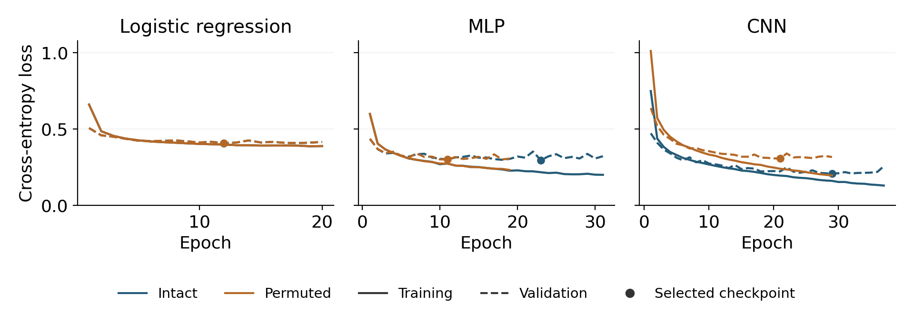
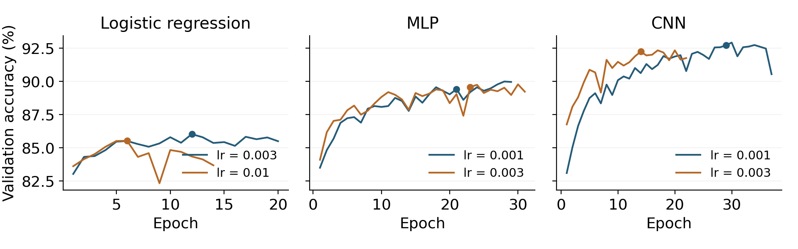

# Understanding the training process

Added 29 September 2026. This walkthrough analyses the existing corrected experiment. No additional models were trained. It follows `src/study.py`, the six saved pilot fits and the eighteen final histories from the three gradient-trained models. The six centroid fits compute class means directly and have no epoch learning curves.

## A Follow one training batch

**Inputs and predictions.** A usual batch has 256 images, each scaled to [0, 1], and 256 integer labels. The CNN receives a tensor of shape 256 × 1 × 28 × 28. Its two convolution and pooling stages produce 256 × 32 × 7 × 7 values; flattening gives 256 × 1,568, followed by a 64-unit hidden layer and ten logits per image. Logistic regression and the MLP flatten the same pixels earlier. A logit is a class score, not yet a probability.

**Loss and gradients.** Cross-entropy converts the logits to a stable classification loss internally. It penalises a low probability for the correct class; confident wrong predictions receive a larger penalty. `loss.backward()` applies the chain rule to calculate how the loss changes with respect to each parameter. It computes gradients but does not itself change the weights. ReLU lets the neural networks model nonlinear relationships.

**Parameter update.** The following is equivalent to the minibatch update in `train_one`:

```python
optimizer.zero_grad(set_to_none=True)
logits = model(x[idx])
loss = nn.functional.cross_entropy(logits, y[idx])
loss.backward()
optimizer.step()
```

Clearing gradients prevents accumulation from earlier batches. Adam uses gradients and running moment estimates to update the weights; the selected learning rate scales the updates, and weight decay 0.0001 adds L2 regularisation. A single update need not reduce validation loss. Nearest centroid instead averages the training images in each class and predicts the nearest average; it uses neither this loss nor backpropagation.

**From batches to evaluation.** One epoch visits all 53,979 training images: 210 full batches plus a final batch of 219, making 211 updates. Validation then uses a fixed model with gradients disabled. A validation-loss improvement greater than 0.0001 saves a checkpoint; eight consecutive epochs without such an improvement stop training, with a maximum of 40. The selected checkpoint is restored before evaluation. Validation selects checkpoints and settings; the corrected test evaluation follows freezing. The earlier test exposure remains disclosed.

<!-- PAGE -->
## B Read the observed learning curves



Figure A1. Seed 42, shown consistently for all three trainable models. Solid lines are training loss, dashed lines validation loss, and dots the selected checkpoints. Blue is intact input; orange is permuted input. Logistic curves almost coincide across conditions. All eighteen final histories are summarised in `reports/training_checkpoint_review.csv`.

| Model and input | Selected / final epoch | Validation loss selected → final |
|---|---|---|
| Logistic intact | 12 / 20 | 0.4066 → 0.4151 |
| Logistic permuted | 12 / 20 | 0.4066 → 0.4151 |
| MLP intact | 23 / 31 | 0.2952 → 0.3213 |
| MLP permuted | 11 / 19 | 0.2997 → 0.3059 |
| CNN intact | 29 / 37 | 0.2065 → 0.2556 |
| CNN permuted | 21 / 29 | 0.3060 → 0.3159 |

**Learning does not mean every curve keeps improving.** For the intact CNN, mean training loss falls from 0.7492 in epoch 1 to 0.1596 at epoch 29, then 0.1289 at epoch 37. Over the last interval, validation loss rises from 0.2065 to 0.2556. The intact MLP similarly reduces training loss from 0.2164 to 0.1993 while validation loss rises from 0.2952 to 0.3213. These patterns are consistent with overfitting and motivate restoring the earlier state, although optimisation fluctuations can also affect validation.

**Architecture and input both matter.** At the selected seed-42 checkpoint, the permuted CNN has validation loss 0.3060, compared with 0.2065 intact. The MLP changes much less, and logistic curves nearly coincide. This agrees with the locality explanation but does not replace the held-out test comparison. Logistic training loss shows relatively small late gains under this protocol; the plot alone cannot prove that its optimiser reached an optimum or isolate limited capacity from optimisation.

**Stopping is not proof of convergence.** All eighteen final trainable runs stopped before 40 epochs. Early stopping identifies a validation-based stopping point, not a mathematical optimum. Training loss is averaged over minibatches while weights are changing; validation loss uses the fixed end-of-epoch model. Their difference is therefore not an exact generalisation-gap estimate for one common checkpoint. Training accuracy was not recorded, so none is inferred here.

<!-- PAGE -->
## C Interpret the learning rate pilots

Six pilot fits used the same original split and seed 42. Each candidate's checkpoint was selected by validation loss under the 0.0001 improvement rule. Candidates were then ranked by that checkpoint's validation accuracy; validation loss and then smaller learning rate break ties. These are validation results, not test scores.

| Model | Learning rate | Selected / final epoch | Validation accuracy % | Validation loss |
|---|---|---|---|---|
| Logistic | 0.003 selected | 12 / 20 | 86.03 | 0.4066 |
| Logistic | 0.01 | 6 / 14 | 85.53 | 0.4183 |
| MLP | 0.001 | 21 / 29 | 89.43 | 0.2879 |
| MLP | 0.003 selected | 23 / 31 | 89.58 | 0.2952 |
| CNN | 0.001 selected | 29 / 37 | 92.73 | 0.2065 |
| CNN | 0.003 | 14 / 22 | 92.25 | 0.2188 |



Figure A2. Existing pilot validation accuracy by epoch. Dots mark loss-selected checkpoints, which need not be the highest-accuracy point on a curve.

**Faster initial learning is not necessarily better selection performance.** The CNN at 0.003 reaches 86.76% validation accuracy after one epoch, versus 83.09% at 0.001. However, its selected checkpoint scores 92.25%, versus 92.73% for 0.001. Logistic regression also selects the smaller of its two rates, by 0.50 percentage points. These observations illustrate a speed–quality tradeoff in these particular runs, not a universal rule that smaller rates are better.

**Accuracy and loss can disagree.** MLP at 0.003 wins by 0.15 points, or nine additional correct predictions among 5,998 validation images, even though 0.001 has lower cross-entropy. Accuracy counts correct argmax decisions; loss also reflects confidence. The declared accuracy-based rule therefore selects 0.003. The 0.001 run's final epoch reaches 89.96% accuracy, but its validation loss is worse than its saved epoch-21 checkpoint; replacing the rule afterwards would change the experiment.

Only two rates and one pilot seed were compared, so these small differences do not establish universally optimal settings. Final three-seed results remain separate from the pilot search; a matching seed-42 final fit is not an extra independent trial. Selected rates stay fixed across intact and permuted conditions. Exact values and timing are in `reports/pilot_comparison.csv`; analysis provenance is in `reports/training_review.json`.
